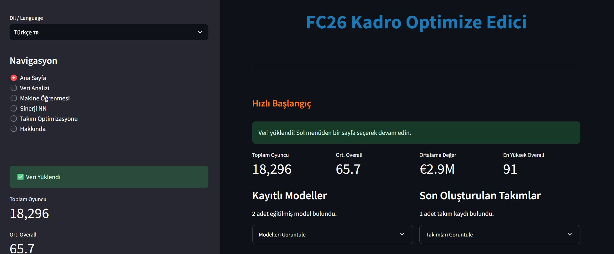
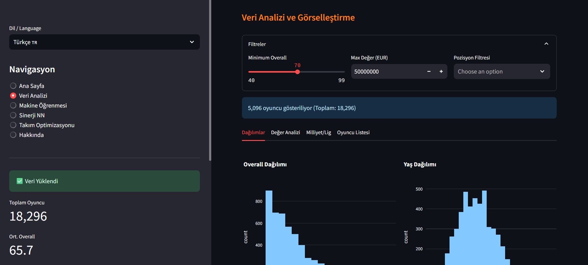
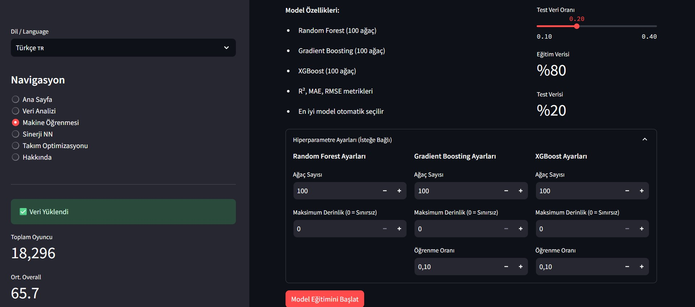
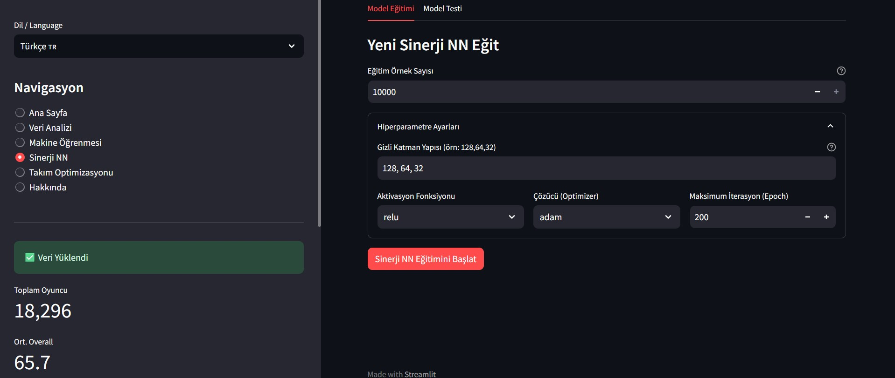
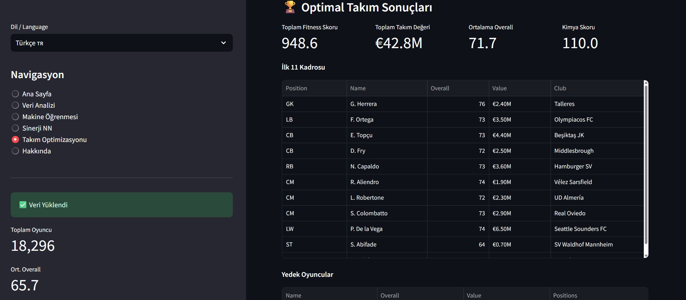

# FC26 AI Squad Optimizer ⚽

Bu proje, makine öğrenmesi, sinir ağları ve genetik algoritmaları bir araya getirerek bütçe ve formasyon kısıtları altında en iyi futbol takımını oluşturan interaktif bir web uygulamasıdır.


<p align="center">
    
    <br/>
    
    <br/>
    
    <br/>
    <i>Streamlit arayüzünde veri analizi, ML/NN eğitimi ve GA optimizasyon ekranları</i>
</p>

Not: Görsellerinizin doğru görünmesi için ekran görüntülerinizi `images/` klasörüne koyun ve README içinde `images/<dosya_adı>.png` şeklinde referans verin.

---

## Proje Hakkında

FC26 AI Squad Optimizer, FC26 oyuncu verilerini analiz eder, oyuncu değerlerini makine öğrenmesi ile tahmin eder, 11 oyunculuk takım sinerjisini bir sinir ağı ile puanlar ve en sonunda genetik algoritma ile belirlenen bütçeye en uygun (fitness’ı en yüksek) takımı oluşturur. Uygulama Streamlit ile interaktiftir ve TR/EN çoklu dil desteği içerir.

## Temel Özellikler

- İnteraktif Veri Analizi: Plotly ile 18,000+ oyuncuyu filtreleyip keşfedin
- Değer Tahmini (ML): Random Forest, Gradient Boosting ve XGBoost ile oyuncu piyasa değerini tahmin edin; undervalued oyuncuları yakalayın
- Sinerji Tahmini (NN): 11 oyuncunun kimya, yaş dengesi ve oyun stili gibi 40+ özelliğinden 0–100 sinerji skoru üretin
- Takım Optimizasyonu (GA): Bütçe ve formasyona göre en yüksek fitness skorlu takımı evrimsel olarak bulun
- Dinamik Hiperparametre: Hem ML hem NN için katman/ağaç sayısı, derinlik, öğrenme oranı vb. ayarları arayüzden değiştirin

## Kullanılan Teknolojiler

- Ana Çatı & Arayüz: Python, Streamlit
- Veri İşleme: Pandas, NumPy
- Makine Öğrenmesi: scikit-learn, XGBoost
- Görselleştirme: Plotly (GUI), Matplotlib/Seaborn (grafik kaydı)
- Model Kaydı: Joblib

## Kurulum

Windows PowerShell için adımlar:

```powershell
# Depoyu klonlayın
git clone https://github.com/Yukseltt/fc26_squad_optimizer.git
cd fc26_squad_optimizer

# Bağımlılıkları kurun
pip install -r requirements.txt
```

Veri: Oyuncu CSV dosyanızı `data/players.csv` yoluna koyun.

Uygulamayı başlatın (GUI):

```powershell
streamlit run app.py
```

---

## Kullanım

1) Sol menüden “Veri Yükle” butonuyla `data/players.csv` yüklenir/temizlenir.
2) “Makine Öğrenmesi” sekmesinde ML modellerini eğitin ve isterseniz kaydedin.
3) “Sinerji NN” sekmesinde sinerji modelini sentetik verilerle eğitin ve kaydedin.
4) “Takım Optimizasyonu” sekmesinde bütçe, formasyon, GA parametrelerini seçin; “Gelişmiş Seçenekler”den eğitilmiş ML/NN’leri dahil edin.
5) “Optimizasyonu Başlat” ile en iyi takım ekrana gelir; CSV olarak kaydedebilirsiniz.

---

## ML: Oyuncu Değeri Tahmini

Arayüzdeki “Makine Öğrenmesi” sayfası üzerinden `PlayerValuePredictor` ile oyuncu değeri (value_eur) tahmin edilir. DataLoader’dan gelen çekirdek özellikler (overall, potential, pace vb.) StandardScaler ile ölçeklenir; eğitim/test ayrımı yapılır ve R²/MAE/RMSE ile raporlanır. Desteklenen modeller: Random Forest, Gradient Boosting, XGBoost (hiperparametreler UI’dan ayarlanır). En iyi model R² ile seçilir; ağaç tabanlılarda feature importance gösterilir. “Değeri Düşük Oyuncular” sekmesi, tahmin/gerçek oranıyla undervalued oyuncuları listeler. Modeller `models/trained_models/ml_model_*.pkl` olarak kaydedilir ve otomatik yükleme desteklenir.

---

## NN: Takım Sinerjisi Tahmini

`TeamSynergyPredictor`, 11 oyunculuk takım için 0–100 arası sinerji skoru üretir. Özellikler; overall/yaş dağılımı, kimya (milliyet/lig kümeleri), oyun stili ort./Std, pozisyon uyumu, hücum-savunma dengesi ve değer dağılımından türetilir. Sentetik veri (433/442/352) ile MLPRegressor (hidden_layer_sizes varsayılan: 128-64-32) eğitilir; R²/MSE raporlanır. `predict_synergy` skor verir, `explain_synergy` kısa özet çıkarır. Modeller `models/trained_models/synergy_nn_*.pkl` olarak kaydedilir.

---

## Genetik Algoritma

`GeneticSquadOptimizer`, bütçe ve formasyona göre en yüksek fitness’lı kadroyu bulur. Fitness; pozisyon uyumu+overall, kimya (proxy), opsiyonel NN sinerji ve opsiyonel ML değer katkısından oluşur. Popülasyon, jenerasyon, elitizm ve mutasyon parametreleri UI’dan ayarlanır. Sonuç CSV’ye aktarılır (`results/best_squads/…`). Ayrıca `src/ml_optimizer.py` GA’sız hızlı bir alternatif sunar.

---

## Proje Yapısı

```
fc26_squad_optimizer/
├── app.py
├── main.py
├── README.md
├── requirements.txt
├── texts.py
├── images/
│   ├── arayuz.jpg
│   ├── arayuz2.jpg
│   ├── arayuz3.jpg
│   ├── arayuz4.jpg
│   └── arayuz5.jpg
├── data/
│   └── players.csv
├── models/
│   └── trained_models/
├── notebooks/
│   ├── data_analysis.py
│   ├── ml_models_script.py
│   └── optimization_script.py
├── results/
│   └── best_squads/
└── src/
        ├── __init__.py
        ├── data_loader.py
        ├── genetic_algorithm.py
        ├── ml_models.py
        ├── ml_optimizer.py
        ├── team_synergy_nn.py
        └── utils.py
```

---

## Model Eğitimleri ve Olası Hatalar

- ML ve NN modellerini arayüz üzerinden çeşitli parametreleri değiştirerek eğitebilrisiniz.
- Eğittiğiniz modelleri kayıt edebilirsiniz.
- Port 8501 dolu → `streamlit run app.py --server.port 8502`
- Optimizasyon yavaş → nesil/popülasyon değerlerini düşürün; ML/NN seçimini kapatın

---

Yazar: @Yukseltt


